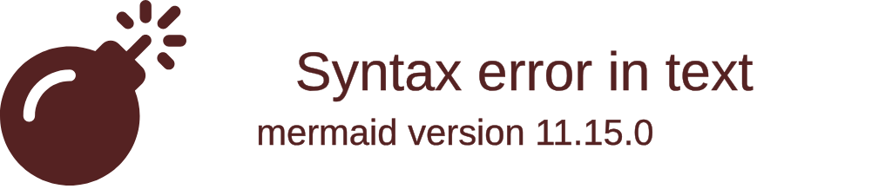
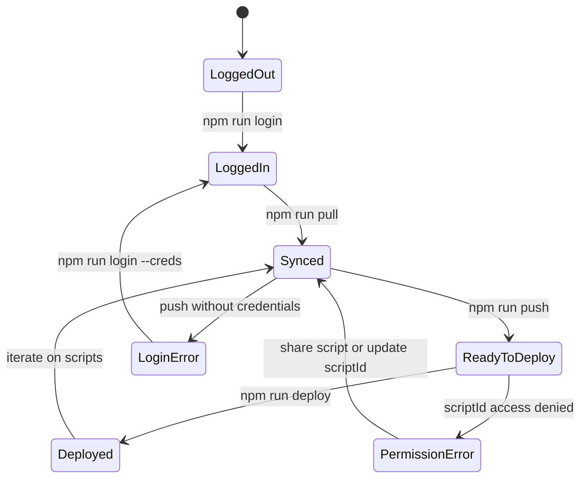
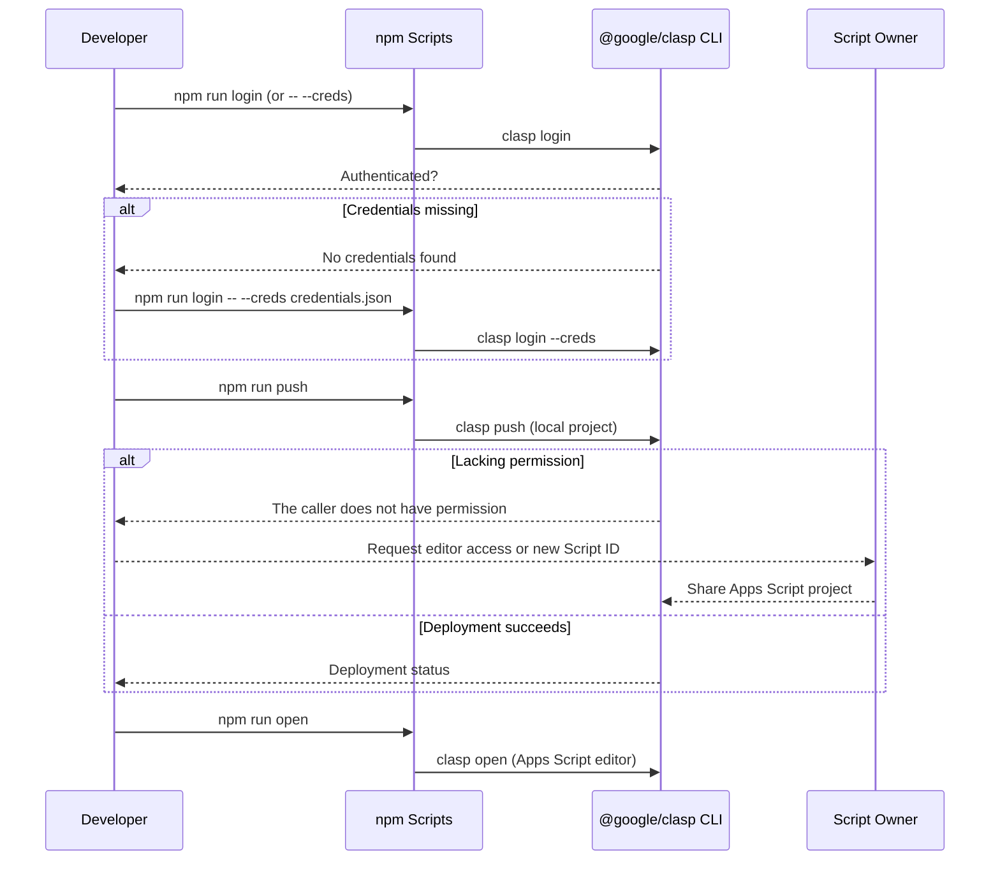
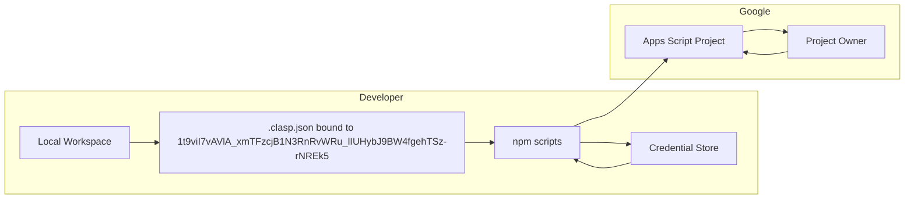
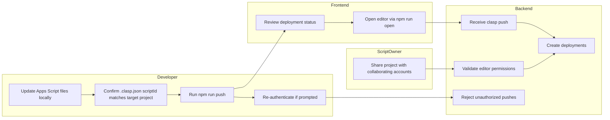

# hello-claps











## Getting started

1. Install dependencies:
   ```bash
   npm install
   ```
2. Verify that `.clasp.json` points at the intended Apps Script project. The current configuration is bound to Script ID `1t9viI7vAVlA_xmTFzcjB1N3RnRvWRu_lIUHybJ9BW4fgehTSz-rNREk5`.

3. Authenticate with Google using the local CLI provided by this project:
   ```bash
   npm run login
   ```

4. Once authenticated, use `npm run pull` to download the remote project or `npm run push` to upload your local changes.

## Available npm scripts

| Script | Description |
| ------ | ----------- |
| `npm run login` | Launches the local `@google/clasp` CLI login flow. |
| `npm run login -- --creds credentials.json` | Uses a downloaded OAuth credentials file if browser-based login is unavailable. |
| `npm run pull` | Downloads the latest code from the bound Apps Script project. |
| `npm run push` | Uploads local source files to Apps Script using the locally installed CLI. |
| `npm run open` | Opens the associated Apps Script project in your browser. |
| `npm run deploy` | Creates a deployment using the currently pushed version. |

All scripts use the locally installed `@google/clasp` binary, so a global installation is not required. If you prefer to keep using a global install, adjust the scripts accordingly.

## Troubleshooting credential errors

If `npm run push` reports `No credentials found.`, re-run the login command. In headless or containerized environments, download an OAuth client credentials JSON from Google Cloud Console and authenticate with:
```bash
npm run login -- --creds path/to/credentials.json
```
After successful login, retry `npm run push`.

## Troubleshooting permission errors

If `npm run push` reports `The caller does not have permission`, the authenticated account does not have edit access to the Apps Script project referenced by `.clasp.json`.

1. Confirm you are targeting the correct Script ID. Update `.clasp.json` if you meant to use a different project.
2. Ask the Apps Script project owner to share the project with your Google account (Apps Script editor → Share → Add editors).
3. After you gain access or update the Script ID, rerun `npm run push`.

## TypeScript projects

This repository is currently JavaScript-only. If you adopt TypeScript, follow the [google/clasp TypeScript template](https://github.com/google/clasp/tree/master/examples/typescript) by adding `npm run build` and `npm run watch` scripts that compile into a `dist/` directory. You can then modify `npm run push` to run the build step before calling `clasp push` to keep the deployment in sync with the compiled output.
