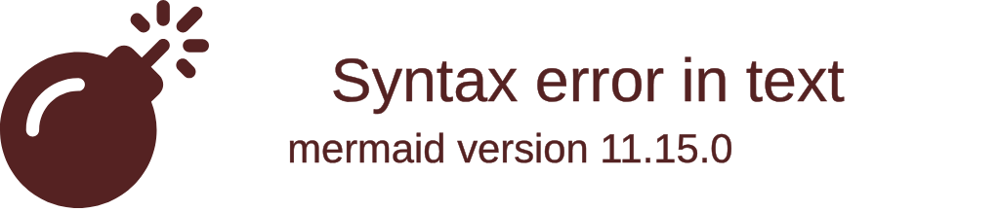
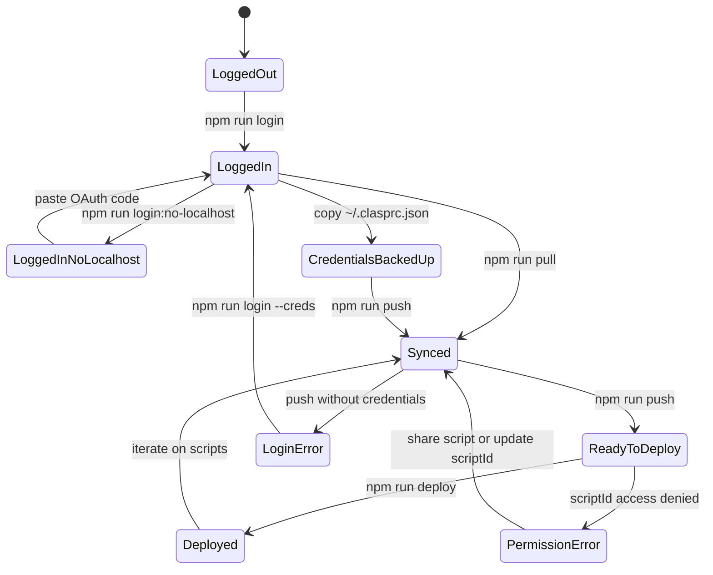
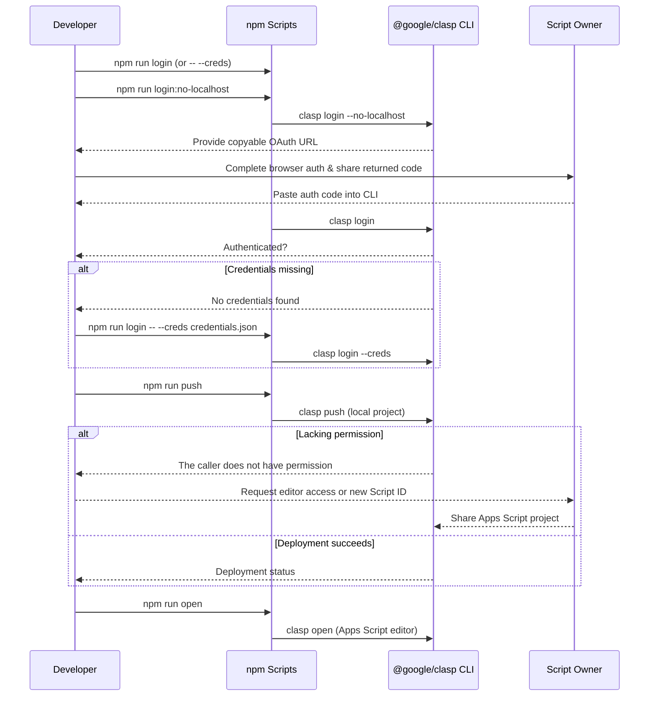
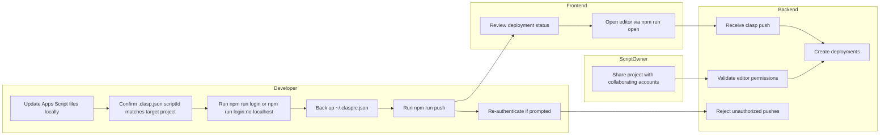

# hello-claps







```mermaid
flowchart LR
  subgraph Developer
    D[Local Workspace]
    F[.clasp.json bound to 1t9viI7vAVlA_xmTFzcjB1N3RnRvWRu_lIUHybJ9BW4fgehTSz-rNREk5]
    S[npm scripts]
    C[Credential Store (~/.clasprc.json)]
    B[Backed-up Credentials]
  end
  subgraph Google
    G[Apps Script Project]
    O[Project Owner]
  end
  D --> F --> S
  S --> C
  C --> S
  C --> B
  B --> C
  S --> G
  O --> G
  G --> O
```



## Getting started

1. Install dependencies:
   ```bash
   npm install
   ```
2. Verify that `.clasp.json` points at the intended Apps Script project. The current configuration is bound to Script ID `1t9viI7vAVlA_xmTFzcjB1N3RnRvWRu_lIUHybJ9BW4fgehTSz-rNREk5`.

3. Authenticate with Google using the local CLI provided by this project:
   ```bash
   npm run login
   ```

   If you cannot open a browser in your environment, run the headless variant:
   ```bash
   npm run login:no-localhost
   ```
   Copy the printed URL, open it in a browser, and paste the returned code back into the CLI prompt.

4. After authentication, back up the credential file that clasp generates so you can restore it later. On most systems the file is stored at `~/.clasprc.json` (and `~/.clasprc.json.local` for additional profiles). Copy these files to a secure location that is **not** committed to version control.

5. Once authenticated and backed up, use `npm run pull` to download the remote project or `npm run push` to upload your local changes.

## Available npm scripts

| Script | Description |
| ------ | ----------- |
| `npm run login` | Launches the local `@google/clasp` CLI login flow. |
| `npm run login:no-localhost` | Starts the `clasp login --no-localhost` flow and prints a copyable OAuth URL. |
| `npm run login -- --creds credentials.json` | Uses a downloaded OAuth credentials file if browser-based login is unavailable. |
| `npm run pull` | Downloads the latest code from the bound Apps Script project. |
| `npm run push` | Uploads local source files to Apps Script using the locally installed CLI. |
| `npm run open` | Opens the associated Apps Script project in your browser. |
| `npm run deploy` | Creates a deployment using the currently pushed version. |

All scripts use the locally installed `@google/clasp` binary, so a global installation is not required. If you prefer to keep using a global install, adjust the scripts accordingly.

## Troubleshooting credential errors

If `npm run push` reports `No credentials found.`, re-run the login command. In headless or containerized environments, download an OAuth client credentials JSON from Google Cloud Console and authenticate with:
```bash
npm run login -- --creds path/to/credentials.json
```
After successful login, retry `npm run push`.

## Preserve your clasp login for future sessions

Clasp stores OAuth tokens in `~/.clasprc.json`. To reuse the same login on another machine or after wiping the environment:

1. After you authenticate, copy `~/.clasprc.json` (and `~/.clasprc.json.local` if it exists) to a private backup location outside your repository.
2. When you return to the project, restore those files to the same paths **before** running any clasp commands.
3. Ensure the file permissions restrict access to your user account, because the tokens grant Apps Script edit rights.

If you accidentally delete the files, rerun `npm run login` or `npm run login:no-localhost` and create a fresh backup.

## Troubleshooting permission errors

If `npm run push` reports `The caller does not have permission`, the authenticated account does not have edit access to the Apps Script project referenced by `.clasp.json`.

1. Confirm you are targeting the correct Script ID. Update `.clasp.json` if you meant to use a different project.
2. Ask the Apps Script project owner to share the project with your Google account (Apps Script editor → Share → Add editors).
3. After you gain access or update the Script ID, rerun `npm run push`.

## TypeScript projects

This repository is currently JavaScript-only. If you adopt TypeScript, follow the [google/clasp TypeScript template](https://github.com/google/clasp/tree/master/examples/typescript) by adding `npm run build` and `npm run watch` scripts that compile into a `dist/` directory. You can then modify `npm run push` to run the build step before calling `clasp push` to keep the deployment in sync with the compiled output.
