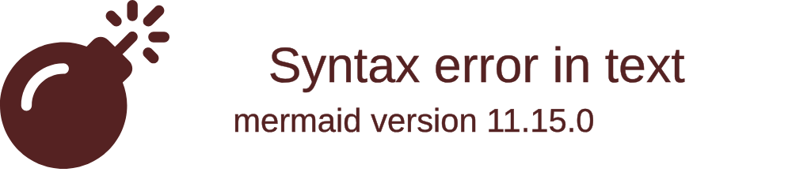
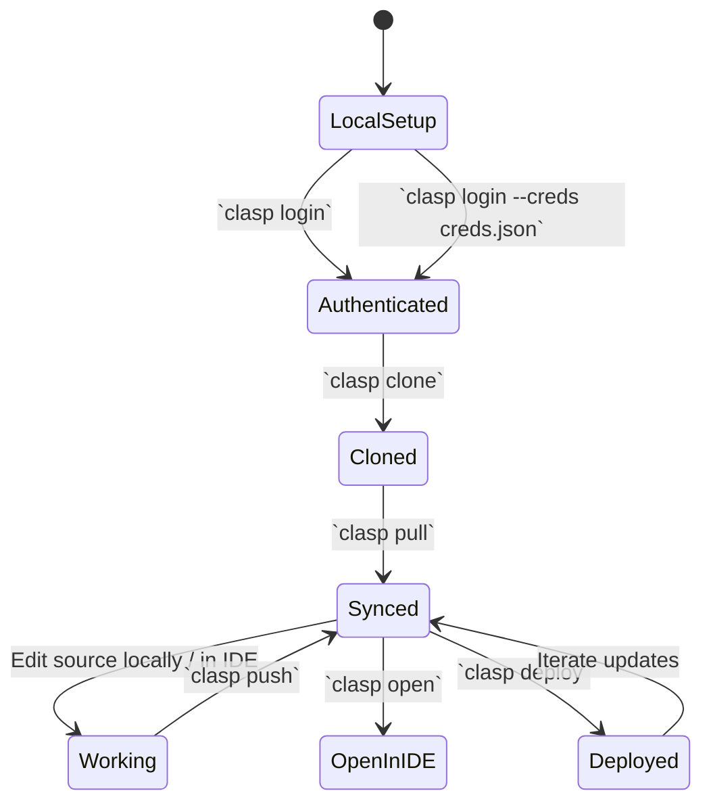
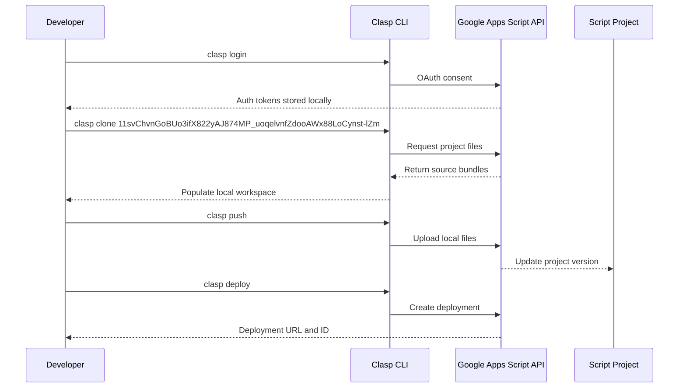
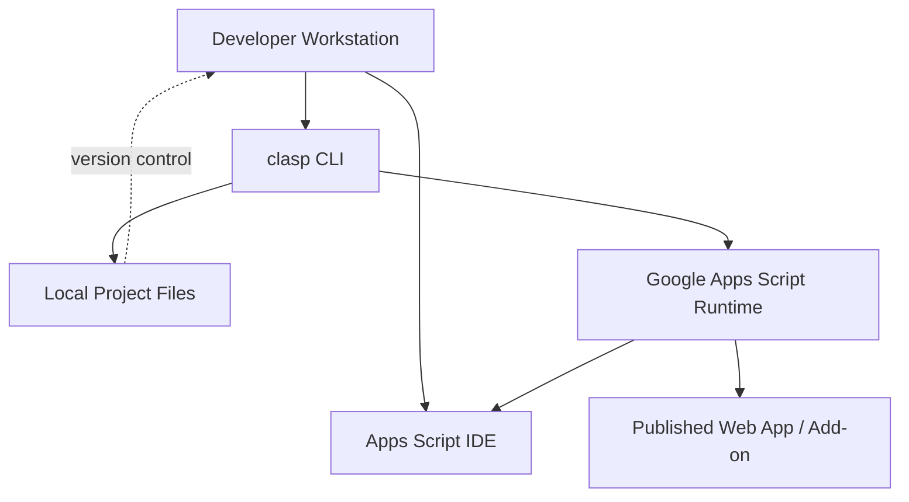

# hello-claps









```mermaid
flowchart LR
    subgraph User
        A[Trigger automation]
        B[Review deployment URL]
    end
    subgraph Frontend (Apps Script IDE)
        C[Configure project settings]
        D[Inspect execution logs]
    end
    subgraph Backend (clasp + Apps Script)
        E[Authenticate via clasp login]
        F[Sync source with clasp pull/push]
        G[Deploy with clasp deploy]
    end

    A --> F
    B --> G
    C --> F
    D --> G
    E --> F
```

## Overview

This repository documents the workflow for managing the Google Apps Script project `11svChvnGoBUo3ifX822yAJ874MP_uoqelvnfZdooAWx88LoCynst-lZm` with the [`@google/clasp`](https://github.com/google/clasp) command-line interface.

## Prerequisites

1. Install a current [Node.js](https://nodejs.org/) runtime.
2. Install the clasp CLI globally:
   ```bash
   npm install -g @google/clasp
   ```
3. Ensure you can sign in with a Google account that has access to the script ID above.

## Authentication

Use clasp to authenticate before interacting with the project.

- Standard OAuth consent in the browser:
  ```bash
  clasp login
  ```
- Service account or headless environments:
  ```bash
  clasp login --creds path/to/credentials.json
  ```
  The JSON file should contain the OAuth client credentials you created in Google Cloud Console.

After logging in, clasp stores tokens in `~/.clasprc.json`. You can check the active account with:
```bash
clasp login --status
```

## Project Initialization

Clone the remote Apps Script project into your local workspace. The script ID is preconfigured for this repository.

```bash
clasp clone 11svChvnGoBUo3ifX822yAJ874MP_uoqelvnfZdooAWx88LoCynst-lZm
```

The command creates a `.clasp.json` file that tracks the script ID and populates your local directory with the project files.

## Daily Workflow

Follow the classic pull-edit-push lifecycle to keep your local files synchronized with Apps Script.

1. **Pull the latest code** to ensure your workspace matches the remote project:
   ```bash
   clasp pull
   ```
2. **Check status** to review pending changes before committing or pushing:
   ```bash
   clasp status
   ```
3. **Edit locally or in the Apps Script IDE.** Use features such as the built-in debugger, execution transcript, and project settings to refine your scripts.
4. **Push local changes** back to Apps Script:
   ```bash
   clasp push
   ```
5. **Open the project** directly in the IDE when you need to work in the browser:
   ```bash
   clasp open
   ```
6. **Create a version and deploy** your changes:
   ```bash
   clasp version "Describe release"
   clasp deploy --description "Describe deployment"
   ```
   Use `clasp deployments` to list existing deployments.

## Deployment Targets

- **Web Apps:** After deploying, clasp returns a web app URL. Share or embed it as needed.
- **Add-ons / Libraries:** Manage manifest settings (`appsscript.json`) locally and push updates before redeploying.

## Troubleshooting

- Review pending diffs:
  ```bash
  clasp status
  ```
- Inspect runtime logs to diagnose execution issues:
  ```bash
  clasp logs --json
  ```
- If authentication expires, rerun `clasp login` or refresh credentials with `clasp login --creds`.
- When merge conflicts arise, pull the latest script first (`clasp pull`), resolve conflicts locally, then push.

## Apps Script IDE Tips

- Use **Editor > Run > Test deployments** to validate triggers without affecting production.
- Access **Executions** for real-time logging and stack traces while iterating with clasp.
- Configure **Project Settings** to manage time zone, execution API, and V8 runtime preferences.
- Leverage **Version History** to correlate clasp deployments with IDE versions.

## Resources

- [clasp documentation](https://github.com/google/clasp)
- [Apps Script dashboard](https://script.google.com/)
- [Apps Script release notes](https://developers.google.com/apps-script/releases)
