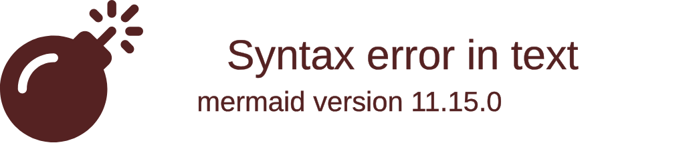
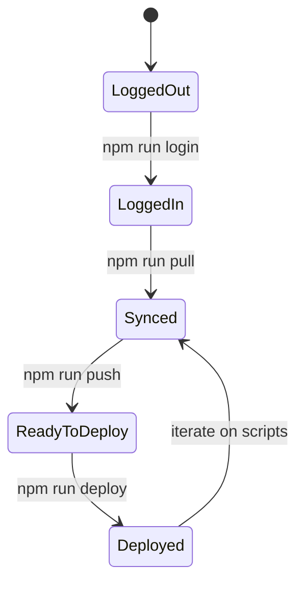
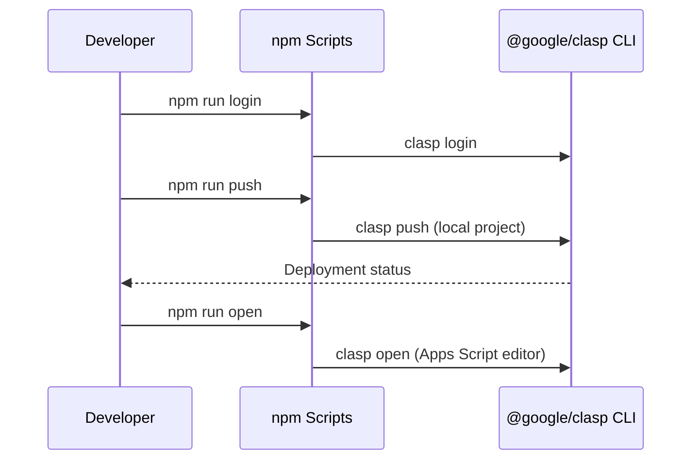
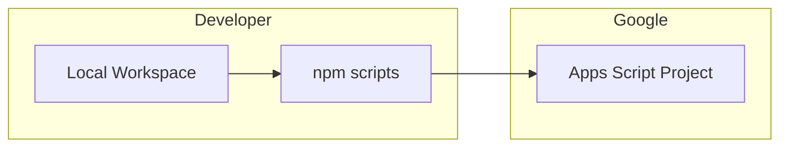
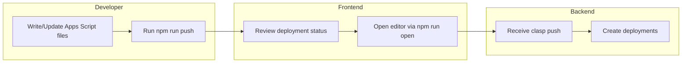

# hello-claps











## Getting started

1. Install dependencies:
   ```bash
   npm install
   ```
2. Authenticate with Google using the local CLI provided by this project:
   ```bash
   npm run login
   ```

## Available npm scripts

| Script | Description |
| ------ | ----------- |
| `npm run login` | Launches the local `@google/clasp` CLI login flow. |
| `npm run pull` | Downloads the latest code from the bound Apps Script project. |
| `npm run push` | Uploads local source files to Apps Script using the locally installed CLI. |
| `npm run open` | Opens the associated Apps Script project in your browser. |
| `npm run deploy` | Creates a deployment using the currently pushed version. |

All scripts use the locally installed `@google/clasp` binary, so a global installation is not required. If you prefer to keep using a global install, adjust the scripts accordingly.

## TypeScript projects

This repository is currently JavaScript-only. If you adopt TypeScript, follow the [google/clasp TypeScript template](https://github.com/google/clasp/tree/master/examples/typescript) by adding `npm run build` and `npm run watch` scripts that compile into a `dist/` directory. You can then modify `npm run push` to run the build step before calling `clasp push` to keep the deployment in sync with the compiled output.
