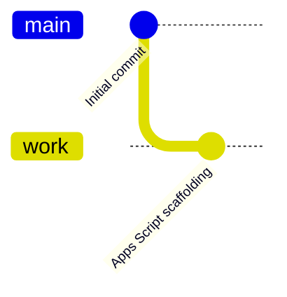
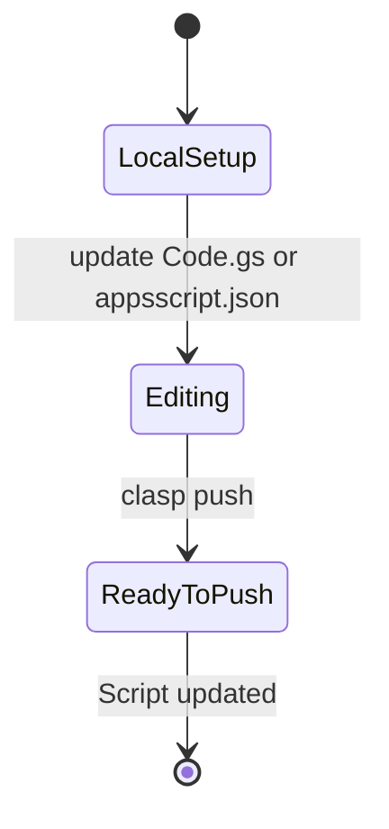
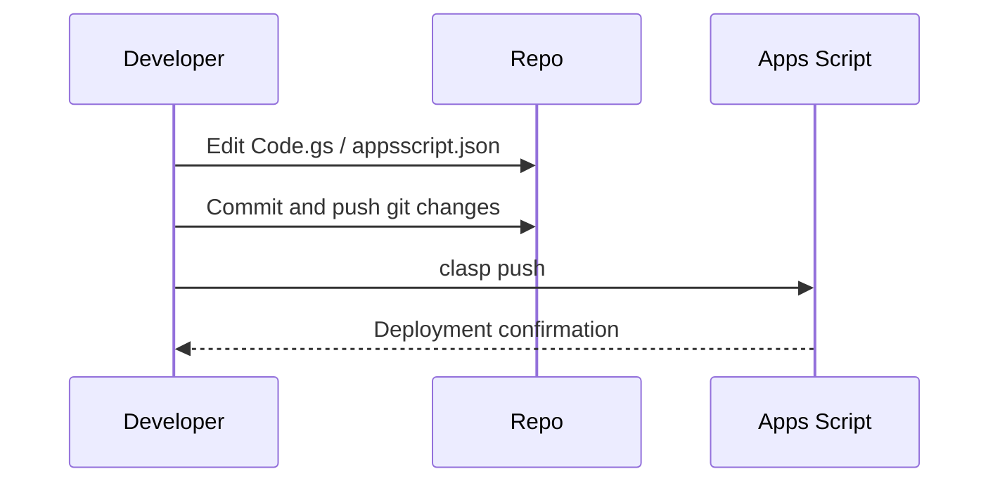
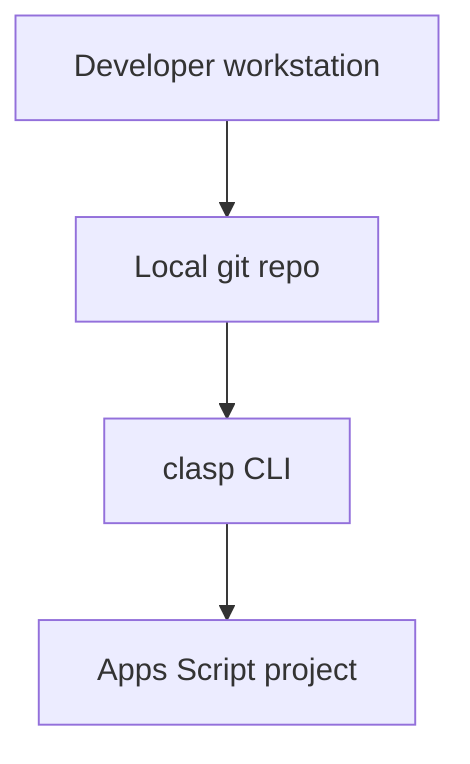

```mermaid
flowchart TB
    subgraph User
        A[Runs deployed script]
    end
    subgraph Frontend
        B[Apps Script UI (e.g. Spreadsheet menu)]
    end
    subgraph Backend
        C[Code.gs myFunction]
        D[Apps Script runtime]
    end
    A --> B --> C --> D
```

# hello-claps

This repository contains a minimal [Google Apps Script](https://developers.google.com/apps-script) project managed locally with [`clasp`](https://github.com/google/clasp).

## Project files

| File | Purpose |
| --- | --- |
| `.clasp.json` | Binds this local folder to script ID `11svChvnGoBUo3ifX822yAJ874MP_uoqelvnfZdooAWx88LoCynst-lZm`. |
| `.claspignore` | Mirrors the default clasp ignore rules, keeping `node_modules`, `.git`, virtual environments, and other local-only files out of Apps Script pushes. |
| `appsscript.json` | Apps Script manifest describing timezone, logging options, and runtime preferences. |
| `Code.gs` | Contains `myFunction()` that logs “Hello, world!” when executed. |

## Local development workflow

1. Install clasp globally if needed: `npm install -g @google/clasp`.
2. Authenticate with Google: `clasp login`.
3. Make changes to `Code.gs` or `appsscript.json` as required.
4. Verify `.claspignore` covers any local folders you do not want to push.
5. Deploy the updates to the bound script: `clasp push`.

## Editing tips

- Keep manifest changes in `appsscript.json` consistent with project requirements (timezone, add-on scopes, etc.).
- Expand `Code.gs` with additional functions while preserving the `myFunction()` example for quick smoke tests.
- Commit README updates alongside code changes so the diagrams accurately reflect the repository state.
