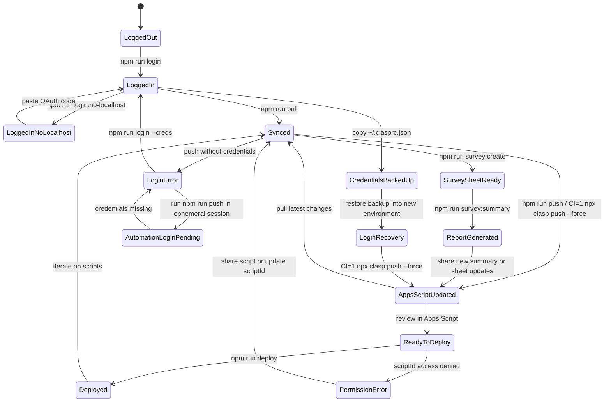
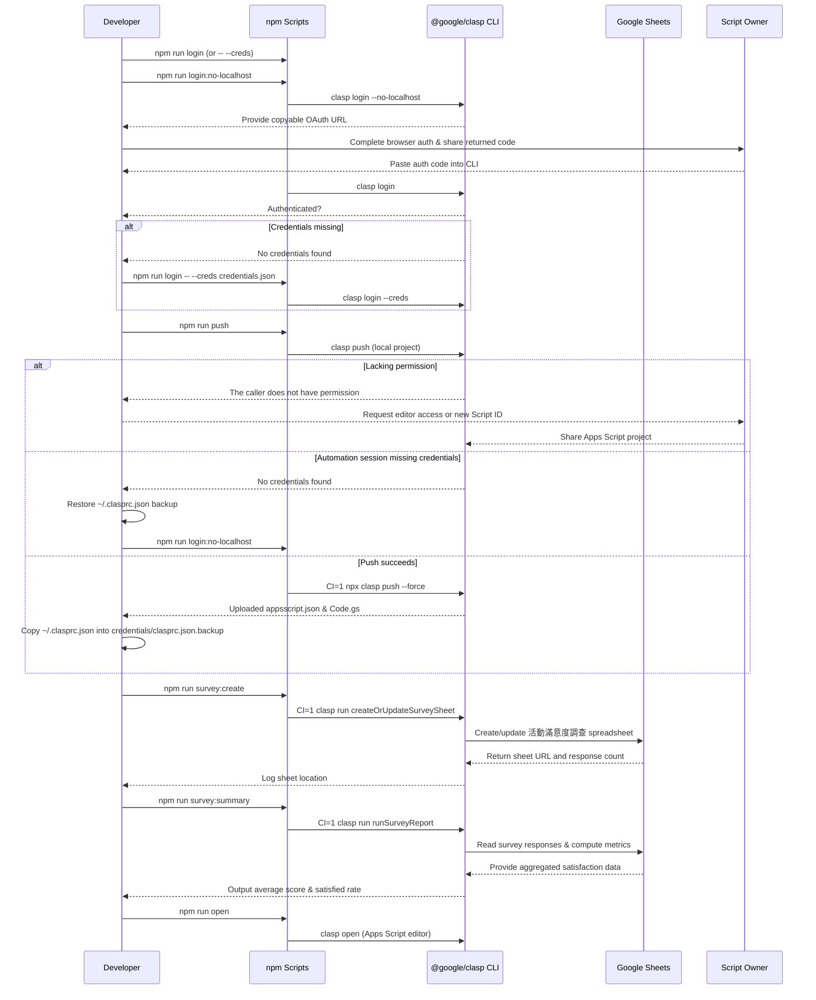

# hello-claps






```mermaid
flowchart LR
  subgraph Developer
    D[Local Workspace]
    F[.clasp.json bound to 1t9viI7vAVlA_xmTFzcjB1N3RnRvWRu_lIUHybJ9BW4fgehTSz-rNREk5]
    S[npm scripts]
    C[Credential Store (~/.clasprc.json)]
    B[Backed-up Credentials\n(credentials/clasprc.json.backup)]
    E[Ephemeral Automation Session]
  end
  subgraph Google
    G[Apps Script Project]
    H[Google Sheets: 活動滿意度調查]
    O[Project Owner]
  end
  D --> F --> S
  S --> C
  C --> S
  C --> B
  B --> C
  E --> S
  E --> C
  S --> G
  G --> H
  H --> G
  H --> D
  O --> G
  G --> O
```

```mermaid
flowchart LR
  subgraph Developer
    direction TB
    A1[Update Apps Script files locally]
    A2[Confirm .clasp.json scriptId matches target project]
    A3[Run npm run login or npm run login:no-localhost]
    A4[Back up ~/.clasprc.json]
    A5[Copy backup to credentials/clasprc.json.backup]
    A6[Restore credentials before ephemeral pushes]
    A7[Run npm run push (CI=1 npx clasp push --force)]
    A8[Re-authenticate if prompted]
    A9[Run npm run survey:create]
    A10[Run npm run survey:summary]
    A11[Distribute 活動滿意度調查報表]
  end
  subgraph Frontend
    direction TB
    B1[Review deployment status]
    B2[Open editor via npm run open]
  end
  subgraph Backend
    direction TB
    C1[Receive clasp push]
    C2[Validate editor permissions]
    C3[Create deployments]
    C4[Reject unauthorized pushes]
    C5[Execute createOrUpdateSurveySheet via clasp run]
    C6[Execute runSurveyReport via clasp run]
  end
  subgraph GoogleSheets
    direction TB
    E1[Persist 活動滿意度調查試算表]
    E2[Aggregate滿意度統計]
  end
  subgraph ScriptOwner
    direction TB
    D1[Share project with collaborating accounts]
  end
  A1 --> A2 --> A3 --> A4 --> A5 --> A6 --> A7 --> B1 --> B2 --> C1 --> C3
  A7 --> A8 --> C4
  A7 --> A9 --> C5 --> E1
  A9 --> A10
  A10 --> C6 --> E2
  A10 --> A11
  D1 --> C2
  C2 --> C3
```

## Getting started

1. Install dependencies:
   ```bash
   npm install
   ```
2. Verify that `.clasp.json` points at the intended Apps Script project. The current configuration is bound to Script ID `1t9viI7vAVlA_xmTFzcjB1N3RnRvWRu_lIUHybJ9BW4fgehTSz-rNREk5`.

3. Authenticate with Google using the local CLI provided by this project:
   ```bash
   npm run login
   ```

   If you cannot open a browser in your environment, run the headless variant:
   ```bash
   npm run login:no-localhost
   ```
   Copy the printed URL, open it in a browser, and paste the returned code back into the CLI prompt.

4. After authentication, back up the credential file that clasp generates so you can restore it later. On most systems the file is stored at `~/.clasprc.json` (and `~/.clasprc.json.local` for additional profiles). Copy these files to a secure location that is **not** committed to version control. This repository also copies the file into `credentials/clasprc.json.backup` for convenience; because the directory is ignored by git, you must store your own secure copy elsewhere if you need a permanent archive.

5. Once authenticated and backed up, use `npm run pull` to download the remote project or `npm run push` to upload your local changes.

6. To provision the 活動滿意度調查 Google Sheet and confirm sample data, run:
   ```bash
   npm run survey:create
   npm run survey:summary
   ```
   The first command creates (or updates) the spreadsheet with headers and demo responses. The second command prints aggregate metrics so you can verify the sheet contents immediately after creation.

## Available npm scripts

| Script | Description |
| ------ | ----------- |
| `npm run login` | Launches the local `@google/clasp` CLI login flow. |
| `npm run login:no-localhost` | Starts the `clasp login --no-localhost` flow and prints a copyable OAuth URL. |
| `npm run login -- --creds credentials.json` | Uses a downloaded OAuth credentials file if browser-based login is unavailable. |
| `npm run pull` | Downloads the latest code from the bound Apps Script project. |
| `npm run push` | Uploads local source files to Apps Script using the locally installed CLI. |
| `npm run open` | Opens the associated Apps Script project in your browser. |
| `npm run deploy` | Creates a deployment using the currently pushed version. |
| `npm run survey:create` | Executes `createOrUpdateSurveySheet` to ensure the 活動滿意度調查 sheet and sample data exist. |
| `npm run survey:summary` | Runs `runSurveyReport` to log overall satisfaction metrics from the sheet. |

All scripts use the locally installed `@google/clasp` binary, so a global installation is not required. If you prefer to keep using a global install, adjust the scripts accordingly.

## 活動滿意度調查 Google Sheet automation

The Apps Script entry point (`Code.gs`) now provisions and reports on a Google Sheets workbook named **活動滿意度調查**. Two exported functions power the workflow:

- `createOrUpdateSurveySheet()` ensures the spreadsheet exists, writes the header row, and seeds three representative responses so the report has data to analyze right away.
- `runSurveyReport()` reads all responses, calculates the average satisfaction score, and reports the percentage of respondents scoring 4 or 5.

The default `myFunction()` simply calls `runSurveyReport()` so `clasp run myFunction` continues to surface the aggregated metrics.

### What the script creates

- Spreadsheet title: **活動滿意度調查**
- Columns: 填寫者, 整體滿意度 (1-5), 最喜歡的環節, 改進建議, 填寫時間
- Seed responses:
  1. 王小明 — 5 分 — 交流分享與實作演練
  2. 陳怡君 — 4 分 — 講者內容清楚易懂
  3. 林志豪 — 3 分 — 互動問答

After running `npm run survey:summary`, the CLI logs a JSON payload similar to:

```json
{
  "sheetUrl": "https://docs.google.com/spreadsheets/d/...",
  "responseCount": 3,
  "averageSatisfaction": 4,
  "satisfiedRate": 66.67
}
```

Use that information to confirm the sheet URL and share the findings with stakeholders.

## Troubleshooting credential errors

If `npm run push` reports `No credentials found.`, re-run the login command. In headless or containerized environments, download an OAuth client credentials JSON from Google Cloud Console and authenticate with:
```bash
npm run login -- --creds path/to/credentials.json
```
After successful login, retry `npm run push`.

### Latest clasp push run

After completing `npx clasp login --no-localhost` with the provided OAuth code, the container executed `CI=1 npx clasp push --force` to avoid interactive prompts. The command succeeded and uploaded both `appsscript.json` and `Code.gs` to Script ID `1t9viI7vAVlA_xmTFzcjB1N3RnRvWRu_lIUHybJ9BW4fgehTSz-rNREk5`.

Immediately after the push, the freshly generated credentials were copied to `credentials/clasprc.json.backup` so that a future session can restore them without reauthenticating.

## Preserve your clasp login for future sessions

Clasp stores OAuth tokens in `~/.clasprc.json`. To reuse the same login on another machine or after wiping the environment:

1. After you authenticate, copy `~/.clasprc.json` (and `~/.clasprc.json.local` if it exists) to a private backup location outside your repository. This repo creates a non-checked-in copy at `credentials/clasprc.json.backup` for convenience.
2. When you return to the project, restore those files to the same paths **before** running any clasp commands. For example, `cp credentials/clasprc.json.backup ~/.clasprc.json`.
3. Ensure the file permissions restrict access to your user account, because the tokens grant Apps Script edit rights. Do not commit the credential backup; `.gitignore` explicitly excludes the `credentials/` directory.

If you accidentally delete the files, rerun `npm run login` or `npm run login:no-localhost` and create a fresh backup.

## Troubleshooting permission errors

If `npm run push` reports `The caller does not have permission`, the authenticated account does not have edit access to the Apps Script project referenced by `.clasp.json`.

1. Confirm you are targeting the correct Script ID. Update `.clasp.json` if you meant to use a different project.
2. Ask the Apps Script project owner to share the project with your Google account (Apps Script editor → Share → Add editors).
3. After you gain access or update the Script ID, rerun `npm run push`.

## TypeScript projects

This repository is currently JavaScript-only. If you adopt TypeScript, follow the [google/clasp TypeScript template](https://github.com/google/clasp/tree/master/examples/typescript) by adding `npm run build` and `npm run watch` scripts that compile into a `dist/` directory. You can then modify `npm run push` to run the build step before calling `clasp push` to keep the deployment in sync with the compiled output.
